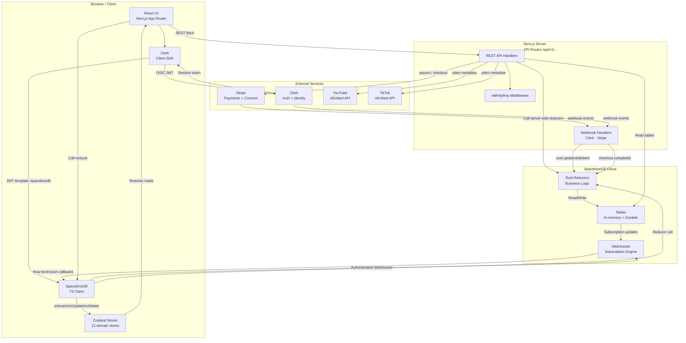
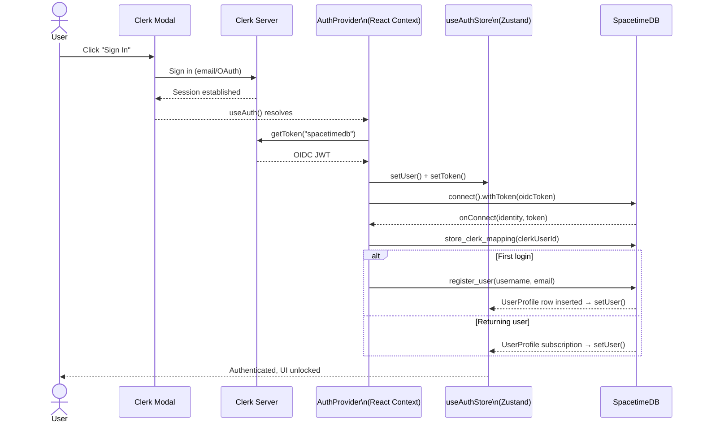
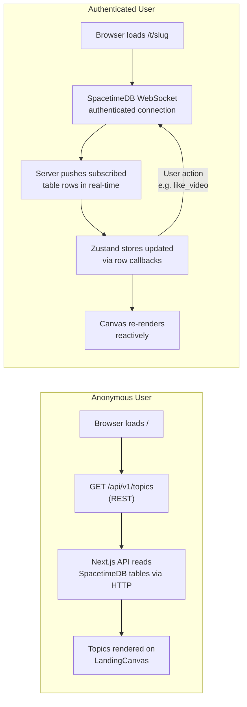
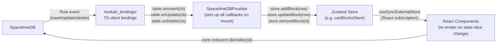
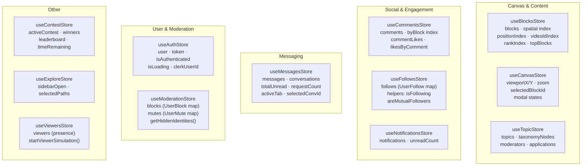
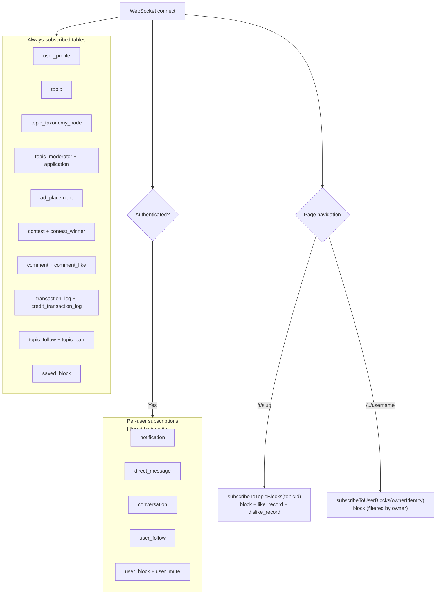
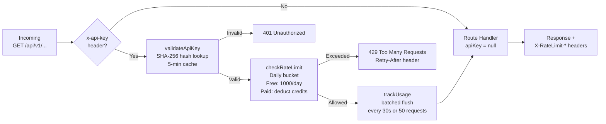

# myVoice — System Architecture

---

## High-Level System Diagram

---

## Authentication Flow

### Identity Bridging

Two identity systems run in parallel:

| System | ID Format | Used For |
|---|---|---|
| Clerk | `user_xxxxxxxxxxxxxxxx` | Auth UX, webhooks, JWT issuance |
| SpacetimeDB | 32-char hex string | All in-app data ownership (blocks, comments, follows, messages) |

`ClerkIdentityMap` table links them: `clerk_user_id → spacetimedb_identity`. When Clerk fires a `user.updated` or `user.deleted` webhook, the server resolves the SpacetimeDB identity via this map and calls the appropriate server-side reducer.

---

## Data Flow: Anonymous vs. Authenticated

**Anonymous path**: No WebSocket. Topics load via `GET /api/v1/topics` which reads SpacetimeDB tables server-side. Fast first paint, no auth overhead.

**Authenticated path**: Persistent WebSocket. SpacetimeDB pushes every relevant row change (blocks, likes, comments, notifications, messages) directly to the client. No polling.

---

## Real-Time Reactivity Loop

SpacetimeDB row callbacks → Zustand mutations → React re-renders. No Redux, no REST polling, no manual cache invalidation.

---

## Zustand Store Map

| Store | Primary Owner | Key Indexes / Helpers |
|---|---|---|
| `useBlocksStore` | Video blocks on a canvas | Spatial bucket index (32×32 cells), `"x,y"→id`, `videoId→id`, rank |
| `useCanvasStore` | Viewport pan/zoom state | `centerOnBlock()`, `zoomBy()` with pivot, modal open/close |
| `useTopicStore` | Topics + taxonomy + mods | `getTopicBySlug()`, `isModeratorForTopic()` |
| `useCommentsStore` | Comments + replies + likes | `getTopLevelComments()`, `getReplies()`, `isLikedByUser()` |
| `useFollowsStore` | User-follow graph | `areMutualFollowers()`, follower/following counts |
| `useNotificationsStore` | In-app notifications | `unreadCount` auto-derived on every write |
| `useMessagesStore` | DMs + conversations | `getPrimaryConversations()`, `getRequestConversations()`, unread counts |
| `useAuthStore` | Current user auth state | Persists to `localStorage`, Clerk ID kept separate from SpacetimeDB identity |
| `useModerationStore` | Blocks + mutes | `isBlocked()` (symmetric), `getHiddenIdentities()` for feed filtering |
| `useContestStore` | Active contest state | Countdown timer, leaderboard |
| `useExploreStore` | Taxonomy sidebar UI | Multi-select `selectedPaths` set |
| `useViewersStore` | Live presence (other viewers) | Mock simulation mode with 25 drifting avatars |

---

## SpacetimeDB Subscription Strategy

---

## API Middleware Stack

