# myVoice — Data Models

All data lives in **SpacetimeDB** — an in-memory, durable, real-time database hosted as a Rust module. Tables are defined in `server/src/tables.rs`.

---

## Entity Relationship Diagram

```mermaid
erDiagram
    UserProfile {
        string identity PK
        string clerk_user_id
        string username
        string display_name
        string email
        string stripe_account_id
        i64 total_earnings
        i64 credits
        bool is_admin
        string bio
        string location
        string website_url
        string social_x
        string social_youtube
        string social_tiktok
        string social_instagram
        u64 created_at
    }

    ClerkIdentityMap {
        string clerk_user_id PK
        string spacetimedb_identity
    }

    Topic {
        u64 id PK
        string slug
        string title
        string description
        string category
        string creator_identity FK
        u32 video_count
        u64 total_likes
        u64 total_dislikes
        u64 total_views
        bool is_active
        u64 created_at
        u64 taxonomy_node_id FK
    }

    Block {
        u64 id PK
        u64 topic_id FK
        i32 x
        i32 y
        string video_id
        string platform
        string owner_identity FK
        string owner_name
        u32 likes
        u32 dislikes
        string status
        u64 yt_views
        u64 yt_likes
        string thumbnail_url
        string ad_image_url
        string ad_link_url
        u64 claimed_at
    }

    TopicTaxonomyNode {
        u64 id PK
        string slug
        string name
        u64 parent_id FK
        string path
        u32 depth
        bool is_active
        u64 created_at
    }

    LikeRecord {
        u64 id PK
        u64 block_id FK
        string user_identity FK
        u64 created_at
    }

    DislikeRecord {
        u64 id PK
        u64 block_id FK
        string user_identity FK
        u64 created_at
    }

    SavedBlock {
        u64 id PK
        string user_identity FK
        u64 block_id FK
        u64 topic_id FK
        u64 created_at
    }

    Comment {
        u64 id PK
        u64 block_id FK
        string user_identity FK
        string user_name
        string text
        u64 created_at
        u64 parent_comment_id FK
        u64 repost_of_id FK
        u32 likes_count
        u32 replies_count
        u32 reposts_count
        u64 edited_at
    }

    CommentLike {
        u64 id PK
        u64 comment_id FK
        string user_identity FK
        u64 created_at
    }

    Notification {
        u64 id PK
        string recipient_identity FK
        string actor_identity FK
        string actor_name
        string notification_type
        u64 block_id FK
        u64 comment_id FK
        bool is_read
        u64 created_at
    }

    UserFollow {
        u64 id PK
        string follower_identity FK
        string following_identity FK
        u64 created_at
    }

    TopicFollow {
        u64 id PK
        string follower_identity FK
        u64 topic_id FK
        u64 created_at
    }

    UserBlock {
        u64 id PK
        string blocker_identity FK
        string blocked_identity FK
        u64 created_at
    }

    UserMute {
        u64 id PK
        string muter_identity FK
        string muted_identity FK
        u64 created_at
    }

    Conversation {
        u64 id PK
        string participant_a
        string participant_b
        string status
        string request_recipient FK
        u64 created_at
        u64 updated_at
    }

    DirectMessage {
        u64 id PK
        u64 conversation_id FK
        string sender_identity FK
        string recipient_identity FK
        string text
        bool is_read
        bool is_deleted
        u64 created_at
    }

    TopicModerator {
        u64 id PK
        u64 topic_id FK
        string identity FK
        string role
        string status
        string granted_by FK
        u64 created_at
    }

    TopicModeratorApplication {
        u64 id PK
        u64 topic_id FK
        string applicant_identity FK
        string message
        string status
        string reviewed_by FK
        u64 created_at
        u64 reviewed_at
    }

    TopicBan {
        u64 id PK
        u64 topic_id FK
        string banned_identity FK
        string banned_by FK
        string reason
        u64 created_at
    }

    UserReport {
        u64 id PK
        string reporter_identity FK
        string reported_identity FK
        string reason
        string description
        string status
        string reviewed_by FK
        u64 created_at
        u64 reviewed_at
    }

    Contest {
        u64 id PK
        u64 start_at
        u64 end_at
        u64 prize_pool
        string status
    }

    ContestWinner {
        u64 id PK
        u64 contest_id FK
        u64 block_id FK
        string owner_identity FK
        string owner_name
        string video_id
        string platform
        u32 likes
        u32 rank
        u64 prize_amount
    }

    TransactionLog {
        u64 id PK
        string tx_type
        u64 amount
        string from_identity FK
        string to_identity FK
        string stripe_id
        string description
        u64 created_at
    }

    CreditTransactionLog {
        u64 id PK
        string user_identity FK
        string tx_type
        i64 amount
        i64 balance_after
        string stripe_payment_id
        string description
        u64 created_at
    }

    AdPlacement {
        u64 id PK
        u64 topic_id FK
        string block_ids_json
        string ad_image_url
        string ad_link_url
        string owner_identity FK
        bool paid
        u64 created_at
        u64 expires_at
    }

    ApiKey {
        u64 id PK
        string key_hash
        string key_prefix
        string name
        string email
        i64 credits
        u64 total_requests
        bool is_active
        u64 created_at
        u64 last_used_at
    }

    ApiUsageLog {
        u64 id PK
        u64 api_key_id FK
        string endpoint
        u32 request_count
        string day
        u64 created_at
    }

    UserProfile ||--o{ Topic : "creates"
    UserProfile ||--o{ Block : "owns"
    UserProfile ||--o{ LikeRecord : "likes"
    UserProfile ||--o{ DislikeRecord : "dislikes"
    UserProfile ||--o{ SavedBlock : "saves"
    UserProfile ||--o{ Comment : "writes"
    UserProfile ||--o{ CommentLike : "likes"
    UserProfile ||--o{ Notification : "receives"
    UserProfile ||--o{ UserFollow : "follows (as follower)"
    UserProfile ||--o{ UserFollow : "followed by (as following)"
    UserProfile ||--o{ TopicFollow : "follows topic"
    UserProfile ||--o{ UserBlock : "blocks"
    UserProfile ||--o{ UserMute : "mutes"
    UserProfile ||--o{ DirectMessage : "sends"
    UserProfile ||--o{ TopicModerator : "moderates"
    UserProfile ||--o{ UserReport : "reports"
    UserProfile ||--o{ ContestWinner : "wins"
    ClerkIdentityMap ||--|| UserProfile : "maps to"
    Topic ||--o{ Block : "contains"
    Topic ||--o| TopicTaxonomyNode : "categorized by"
    Topic ||--o{ TopicModerator : "has"
    Topic ||--o{ TopicFollow : "followed by"
    Topic ||--o{ TopicBan : "bans"
    Topic ||--o{ AdPlacement : "hosts"
    Block ||--o{ LikeRecord : "receives"
    Block ||--o{ DislikeRecord : "receives"
    Block ||--o{ SavedBlock : "saved as"
    Block ||--o{ Comment : "has"
    Block ||--o{ ContestWinner : "placed as"
    Comment ||--o{ CommentLike : "receives"
    Comment ||--o{ Comment : "replied to by"
    Conversation ||--o{ DirectMessage : "contains"
    Contest ||--o{ ContestWinner : "produces"
    ApiKey ||--o{ ApiUsageLog : "generates"
    UserProfile ||--o{ CreditTransactionLog : "has credits"
```

---

## Tables by Domain

### Content

#### `Topic`
The central entity — a named canvas with its own video grid.

| Field | Type | Notes |
|---|---|---|
| `id` | `u64` PK auto_inc | |
| `slug` | `string` unique | URL-safe identifier (e.g. `best-skateboarding`) |
| `title` | `string` | Display name |
| `description` | `string` | |
| `category` | `string` | Must match allowlist (science, sports, gaming, …) |
| `creator_identity` | `string` FK | References `UserProfile.identity` |
| `video_count` | `u32` | Claimed blocks count (maintained by reducers) |
| `total_likes` | `u64` | Sum of all block likes |
| `total_dislikes` | `u64` | Sum of all block dislikes |
| `total_views` | `u64` | Page view counter |
| `is_active` | `bool` | Soft-delete flag |
| `taxonomy_node_id` | `u64?` FK | Optional `TopicTaxonomyNode` reference |
| `created_at` | `u64` | Unix ms |

#### `Block`
A single claimed position on a topic's grid, containing one video.

| Field | Type | Notes |
|---|---|---|
| `id` | `u64` PK auto_inc | |
| `topic_id` | `u64` FK | Parent topic |
| `x`, `y` | `i32` | Spiral grid coordinates. `(0,0)` = center = highest score |
| `video_id` | `string` | YouTube/TikTok/BiliBili video ID |
| `platform` | `string` | `"youtube"` \| `"tiktok"` \| `"bilibili"` |
| `owner_identity` | `string` FK | |
| `owner_name` | `string` | Denormalized for display |
| `likes` | `u32` | In-app like count |
| `dislikes` | `u32` | |
| `status` | `string` | `"claimed"` \| `"empty"` \| `"ad"` |
| `yt_views`, `yt_likes` | `u64` | External platform metrics (YouTube) |
| `thumbnail_url` | `string` | Cached thumbnail |
| `ad_image_url`, `ad_link_url` | `string?` | Set when `status = "ad"` |
| `claimed_at` | `u64` | Unix ms |

#### `TopicTaxonomyNode`
Hierarchical category tree for organizing topics.

| Field | Type | Notes |
|---|---|---|
| `id` | `u64` PK auto_inc | |
| `slug` | `string` unique | Path segment |
| `name` | `string` | Human-readable label |
| `parent_id` | `u64?` | `null` = root node |
| `path` | `string` | Full dot-joined path, e.g. `technology.ai` |
| `depth` | `u32` | 0 = root, 1 = subcategory, … |
| `is_active` | `bool` | |
| `created_at` | `u64` | |

---

### Users & Auth

#### `UserProfile`
Every registered user. Created on first WebSocket connection via `register_user` reducer.

| Field | Type | Notes |
|---|---|---|
| `identity` | `string` PK | SpacetimeDB hex identity (32 chars) |
| `clerk_user_id` | `string` | Clerk's `user_xxx` string |
| `username` | `string` | Unique, URL-safe |
| `display_name` | `string` | |
| `email` | `string` | |
| `stripe_account_id` | `string?` | Stripe Connect account ID for payouts |
| `total_earnings` | `i64` | Cents, updated after contest finalization |
| `credits` | `i64` | In-app credits. New users: 10. Purchasable via Stripe |
| `is_admin` | `bool` | Grants access to all admin reducers |
| `bio` | `string?` | ≤ 160 chars |
| `location` | `string?` | ≤ 100 chars |
| `website_url` | `string?` | ≤ 200 chars |
| `social_x/youtube/tiktok/instagram` | `string?` | Social handles |
| `created_at` | `u64` | |

#### `ClerkIdentityMap`
Bridge between Clerk and SpacetimeDB identity systems.

| Field | Type | Notes |
|---|---|---|
| `clerk_user_id` | `string` PK | |
| `spacetimedb_identity` | `string` | SpacetimeDB hex identity |

---

### Engagement

#### `LikeRecord` / `DislikeRecord`
One row per user-per-block like or dislike. Mutual exclusion enforced by reducers (liking auto-removes an existing dislike and vice versa).

| Field | Type | Notes |
|---|---|---|
| `id` | `u64` PK | |
| `block_id` | `u64` FK | |
| `user_identity` | `string` FK | Unique constraint with `block_id` (no duplicate votes) |
| `created_at` | `u64` | |

#### `SavedBlock`
User bookmarks for blocks.

| Field | Type | Notes |
|---|---|---|
| `id` | `u64` PK | |
| `user_identity` | `string` FK | |
| `block_id` | `u64` FK | |
| `topic_id` | `u64` FK | Denormalized for fast per-topic queries |
| `created_at` | `u64` | |

#### `Comment`
Comments, replies, and reposts on blocks. Self-referential for threading.

| Field | Type | Notes |
|---|---|---|
| `id` | `u64` PK | |
| `block_id` | `u64` FK | |
| `user_identity` | `string` FK | |
| `user_name` | `string` | Denormalized |
| `text` | `string` | Max 280 chars |
| `parent_comment_id` | `u64?` | `null` = top-level; set = reply |
| `repost_of_id` | `u64?` | `null` = original; set = quote-repost |
| `likes_count` | `u32` | Maintained by `like_comment` / `unlike_comment` |
| `replies_count` | `u32` | Maintained by `add_comment` (reply) / `delete_comment` |
| `reposts_count` | `u32` | Maintained by `repost_comment` |
| `edited_at` | `u64?` | Set by `edit_comment` |
| `created_at` | `u64` | |

#### `CommentLike`
One row per user-per-comment like.

| Field | Type | Notes |
|---|---|---|
| `id` | `u64` PK | |
| `comment_id` | `u64` FK | |
| `user_identity` | `string` FK | |
| `created_at` | `u64` | |

#### `Notification`
All in-app notifications. Consumed by `useNotificationsStore`.

| Field | Type | Notes |
|---|---|---|
| `id` | `u64` PK | |
| `recipient_identity` | `string` FK | Who receives it |
| `actor_identity` | `string` FK | Who triggered it |
| `actor_name` | `string` | Denormalized |
| `notification_type` | `string` | See types below |
| `block_id` | `u64?` FK | Context reference |
| `comment_id` | `u64?` FK | Context reference |
| `is_read` | `bool` | |
| `created_at` | `u64` | |

Notification types: `comment_reply` · `comment_like` · `comment_repost` · `video_like` · `new_follow` · `new_message` · `message_request` · `topic_new_video` · `contest_result` · `moderator_application_reviewed`

---

### Social Graph

#### `UserFollow`
One row per directed follow relationship.

| Field | Type | Notes |
|---|---|---|
| `id` | `u64` PK | |
| `follower_identity` | `string` FK | |
| `following_identity` | `string` FK | |
| `created_at` | `u64` | |

> When a mutual follow is created, the `follow_user` reducer automatically upgrades any `request_pending` conversation between the two users to `active`.

#### `TopicFollow`
Subscribes a user to a topic's content feed.

| Field | Type | Notes |
|---|---|---|
| `id` | `u64` PK | |
| `follower_identity` | `string` FK | |
| `topic_id` | `u64` FK | |
| `created_at` | `u64` | |

#### `UserBlock`
Blocks another user. Symmetric check used for content filtering.

| Field | Type | Notes |
|---|---|---|
| `id` | `u64` PK | |
| `blocker_identity` | `string` FK | |
| `blocked_identity` | `string` FK | |
| `created_at` | `u64` | |

> `block_user` reducer also removes follows in both directions as a side effect.

#### `UserMute`
Silent mute — hides the muted user's content without them knowing.

| Field | Type | Notes |
|---|---|---|
| `id` | `u64` PK | |
| `muter_identity` | `string` FK | |
| `muted_identity` | `string` FK | |
| `created_at` | `u64` | |

---

### Messaging

#### `Conversation`
A 1:1 conversation thread. Participant ordering is lexicographic to prevent duplicates.

| Field | Type | Notes |
|---|---|---|
| `id` | `u64` PK | |
| `participant_a` | `string` | Lexicographically lower identity |
| `participant_b` | `string` | Lexicographically higher identity |
| `status` | `string` | `"active"` \| `"request_pending"` \| `"request_declined"` |
| `request_recipient` | `string?` | Who must accept for non-mutual-follower conversations |
| `created_at` | `u64` | |
| `updated_at` | `u64` | Bumped on every new message |

#### `DirectMessage`
A single message within a conversation.

| Field | Type | Notes |
|---|---|---|
| `id` | `u64` PK | |
| `conversation_id` | `u64` FK | |
| `sender_identity` | `string` FK | |
| `recipient_identity` | `string` FK | |
| `text` | `string` | Max 1000 chars |
| `is_read` | `bool` | |
| `is_deleted` | `bool` | Soft-delete via `delete_conversation` |
| `created_at` | `u64` | |

---

### Moderation

#### `TopicModerator`
Elevated role within a specific topic.

| Field | Type | Notes |
|---|---|---|
| `id` | `u64` PK | |
| `topic_id` | `u64` FK | |
| `identity` | `string` FK | |
| `role` | `string` | `"owner"` \| `"moderator"` |
| `status` | `string` | `"active"` \| `"removed"` |
| `granted_by` | `string` FK | |
| `created_at` | `u64` | |

#### `TopicModeratorApplication`
Application to become a topic moderator. 24-hour cooldown after rejection.

| Field | Type | Notes |
|---|---|---|
| `id` | `u64` PK | |
| `topic_id` | `u64` FK | |
| `applicant_identity` | `string` FK | |
| `message` | `string` | Motivation statement |
| `status` | `string` | `"pending"` \| `"approved"` \| `"rejected"` |
| `reviewed_by` | `string?` FK | |
| `created_at` | `u64` | |
| `reviewed_at` | `u64?` | |

#### `TopicBan`
Bans a user from claiming blocks in a specific topic.

| Field | Type | Notes |
|---|---|---|
| `id` | `u64` PK | |
| `topic_id` | `u64` FK | |
| `banned_identity` | `string` FK | |
| `banned_by` | `string` FK | |
| `reason` | `string` | |
| `created_at` | `u64` | |

#### `UserReport`
A user report filed against another user.

| Field | Type | Notes |
|---|---|---|
| `id` | `u64` PK | |
| `reporter_identity` | `string` FK | |
| `reported_identity` | `string` FK | |
| `reason` | `string` | `spam` \| `harassment` \| `hate_speech` \| `impersonation` \| `other` |
| `description` | `string?` | ≤ 500 chars |
| `status` | `string` | `"pending"` \| `"reviewed"` \| `"dismissed"` |
| `reviewed_by` | `string?` FK | Admin identity |
| `created_at`, `reviewed_at` | `u64` | |

---

### Contests & Finance

#### `Contest`
A time-bounded video competition. Only one active contest at a time (enforced by reducer).

| Field | Type | Notes |
|---|---|---|
| `id` | `u64` PK | |
| `start_at` | `u64` | Unix ms |
| `end_at` | `u64` | |
| `prize_pool` | `u64` | Cents |
| `status` | `string` | `"active"` \| `"finalizing"` \| `"completed"` |

#### `ContestWinner`
Top-2 finishers per contest with prize amounts.

| Field | Type | Notes |
|---|---|---|
| `id` | `u64` PK | |
| `contest_id` | `u64` FK | |
| `block_id` | `u64` FK | |
| `owner_identity` | `string` FK | |
| `owner_name` | `string` | Denormalized |
| `video_id`, `platform` | `string` | |
| `likes` | `u32` | At time of finalization |
| `rank` | `u32` | 1 or 2 |
| `prize_amount` | `u64` | Cents |

#### `TransactionLog`
Stripe payment/payout ledger.

| Field | Type | Notes |
|---|---|---|
| `id` | `u64` PK | |
| `tx_type` | `string` | e.g. `"contest_payout"`, `"ad_payment"` |
| `amount` | `u64` | Cents |
| `from_identity`, `to_identity` | `string` FK | |
| `stripe_id` | `string` | Stripe transaction ID |
| `description` | `string` | |
| `created_at` | `u64` | |

#### `CreditTransactionLog`
In-app credit ledger. Every credit balance change is logged here.

| Field | Type | Notes |
|---|---|---|
| `id` | `u64` PK | |
| `user_identity` | `string` FK | |
| `tx_type` | `string` | `"signup_bonus"` \| `"purchase"` \| `"spend"` |
| `amount` | `i64` | Positive = credit, negative = debit |
| `balance_after` | `i64` | Running balance snapshot |
| `stripe_payment_id` | `string?` | Set for `"purchase"` type |
| `description` | `string` | |
| `created_at` | `u64` | |

#### `AdPlacement`
An advertisement occupying one or more blocks in a topic grid.

| Field | Type | Notes |
|---|---|---|
| `id` | `u64` PK | |
| `topic_id` | `u64` FK | |
| `block_ids_json` | `string` | JSON array of block IDs |
| `ad_image_url`, `ad_link_url` | `string` | Creative + destination |
| `owner_identity` | `string` FK | Advertiser |
| `paid` | `bool` | True once Stripe checkout confirmed |
| `created_at`, `expires_at` | `u64` | |

---

### Developer API

#### `ApiKey`
External developer API key. Raw key never stored — only SHA-256 hash.

| Field | Type | Notes |
|---|---|---|
| `id` | `u64` PK | |
| `key_hash` | `string` unique | SHA-256 of the raw `mv_xxxxx` key |
| `key_prefix` | `string` | First 12 chars for safe display |
| `name` | `string` | Developer name |
| `email` | `string` | |
| `credits` | `i64` | Purchased API request credits |
| `total_requests` | `u64` | Lifetime request count |
| `is_active` | `bool` | False = revoked |
| `created_at`, `last_used_at` | `u64` | |

#### `ApiUsageLog`
Per-endpoint, per-day usage aggregation.

| Field | Type | Notes |
|---|---|---|
| `id` | `u64` PK | |
| `api_key_id` | `u64` FK | |
| `endpoint` | `string` | e.g. `/api/v1/topics` |
| `request_count` | `u32` | Incremented per request (upserted) |
| `day` | `string` | `"YYYYMMDD"` format |
| `created_at` | `u64` | |
