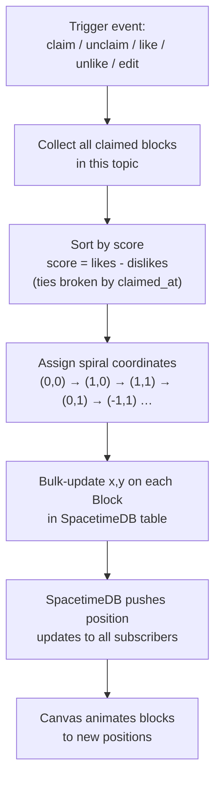
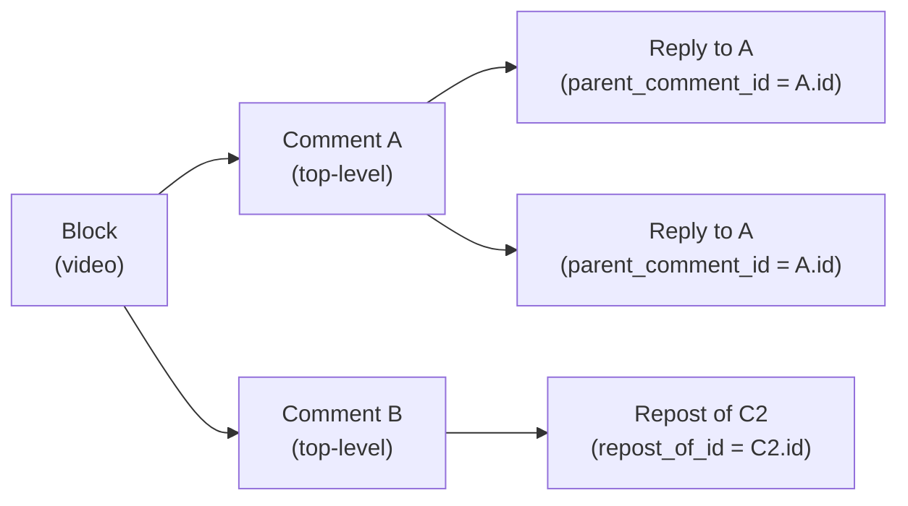
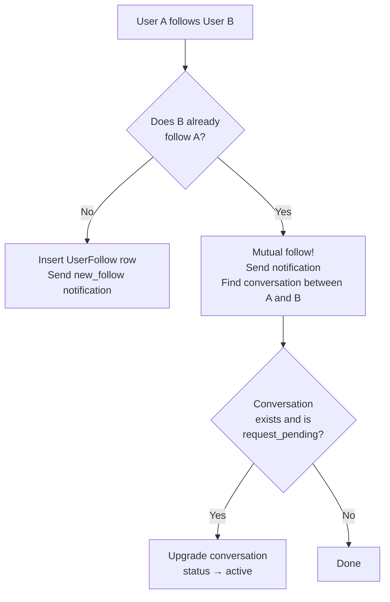
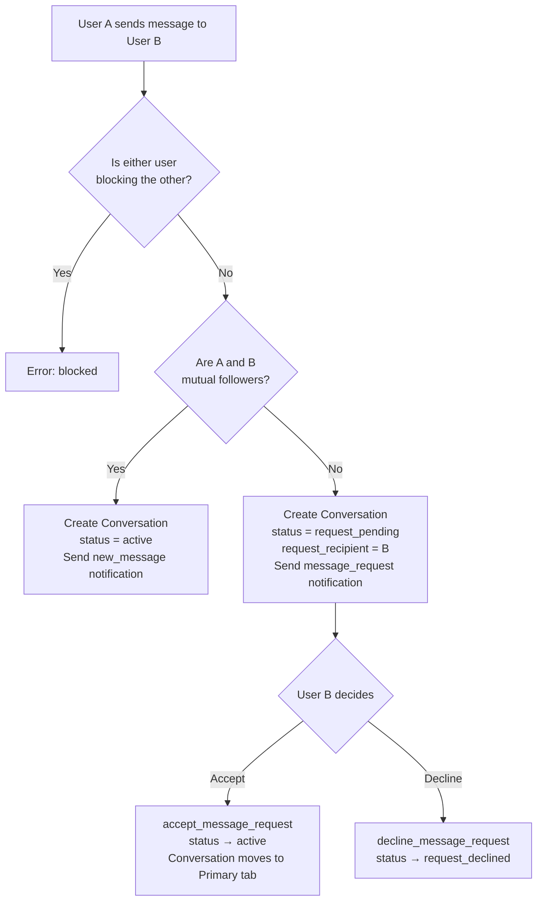
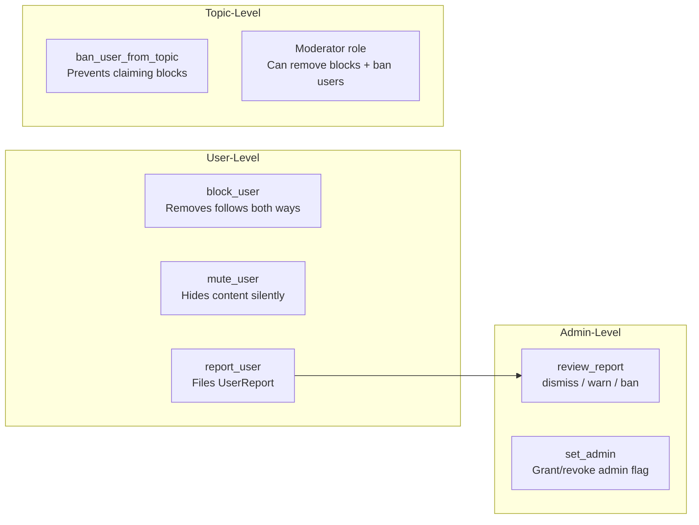
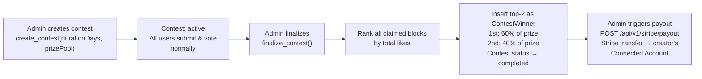
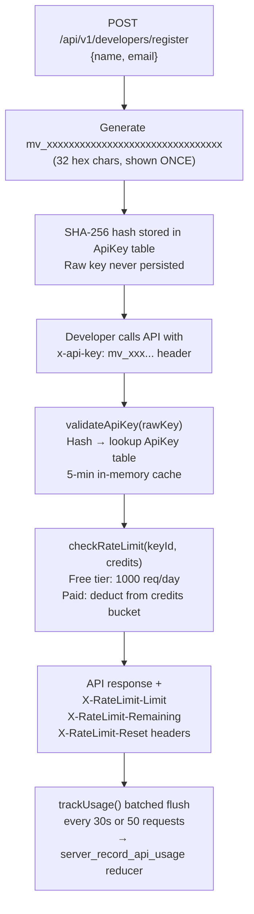
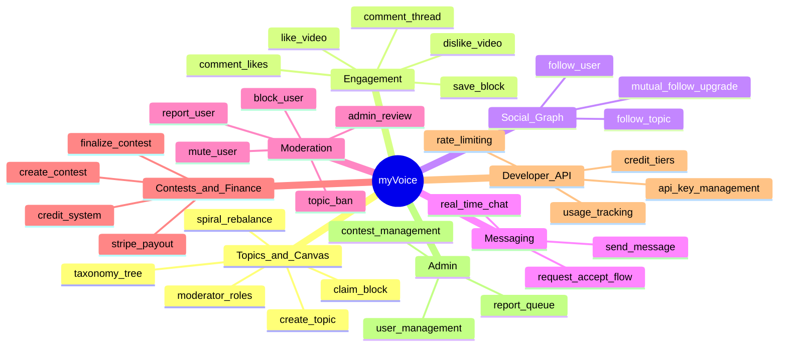

# myVoice — Feature Inventory

All features are implemented as **Rust reducers** (server-side logic in `server/src/reducers/`) paired with **Next.js API routes** (`src/app/api/v1/`) and **React components** (`src/components/` + `src/app/`).

---

## 1. Topics & Canvas

### What It Does

Users create **topics** — named canvases where videos compete for the center position. Each topic has a category, taxonomy, and its own grid of `Block`s arranged in an outward spiral scored by engagement.

### The Spiral Rebalance

Every like, dislike, claim, or unclaim triggers a full rebalance: all blocks in the topic are re-ranked by score and reassigned coordinates in spiral order — the highest-scoring video always occupies `(0,0)`.

### Reducers (`server/src/reducers/topic.rs` + `claim.rs`)

| Reducer | Access | Description |
|---|---|---|
| `create_topic` | Any registered user | Creates topic + slug, validates category, creates taxonomy node, inserts creator as `owner` moderator |
| `claim_block_in_topic` | Any registered user (not banned) | Submits a video; checks for duplicate video ID across topic; inserts `Block`; rebalances spiral |
| `increment_topic_views` | Any user | Bumps `total_views` on the topic |
| `update_topic` | Moderator or admin | Updates title / description / category |
| `delete_topic` | Owner (with successor logic) or admin | If sole owner → full cascade delete; otherwise selects a successor moderator / contributor and transfers ownership |
| `unclaim_block` | Block owner or admin | Removes block; decrements `video_count`; rebalances |
| `mod_remove_block` | Topic owner, moderator, or admin | Same as unclaim but any block |
| `edit_block` | Block owner only | Replaces video; resets likes/dislikes/yt-metrics; clears old `LikeRecord`s; rebalances |
| `create_topic_taxonomy_node` | Admin (root) or any user (subcategory) | Creates a node in the category hierarchy |
| `set_topic_taxonomy` | Moderator or admin | Assigns a topic to a taxonomy node |
| `apply_topic_moderator` | Any registered user | Submits a moderator application (24-hour cooldown after rejection) |
| `review_topic_moderator_application` | Topic owner or admin | Approves or rejects a pending application; creates `TopicModerator` row on approval |
| `remove_topic_moderator` | Topic owner or admin | Removes moderator role (owner role is protected) |
| `backfill_topic_taxonomy_from_categories` | Admin only | One-off migration: creates taxonomy nodes for topics missing them |

### API Routes

| Method | Path | Description |
|---|---|---|
| `GET` | `/api/v1/topics` | All topics with taxonomy metadata and top video per topic |
| `GET` | `/api/v1/topics/:slug` | Single topic + top 20 blocks by score |
| `GET` | `/api/v1/topics/:slug/comments` | Paginated comments for a topic (optionally filtered to a block) |
| `GET` | `/api/v1/data` | Canvas viewport data — blocks filtered by topic and bounding box |
| `GET` | `/api/v1/compare` | Side-by-side comparison of 2–4 topics by slug |
| `GET` | `/api/v1/popular` | Top blocks cross-topic, sorted by composite score |
| `GET` | `/api/v1/stats` | Platform aggregate stats (topics, blocks, users, comments) |
| `POST` | `/api/v1/video-meta` | Resolves a YouTube/TikTok/BiliBili URL → metadata (title, thumbnail, embedUrl) |
| `GET` | `/api/v1/thumbnail/proxy` | Image proxy for any HTTPS thumbnail URL |
| `GET` | `/api/v1/thumbnail/tiktok` | Server-side TikTok thumbnail fetch with 5h cache |

---

## 2. Likes, Dislikes & Saves

### What It Does

Users vote on videos (like or dislike) to push them toward or away from the center. Saving bookmarks a video for later. Every like/dislike call triggers the spiral rebalance.

### Reducers (`server/src/reducers/like.rs`)

| Reducer | Notes |
|---|---|
| `like_video` | Cannot like own video; auto-removes existing dislike; sends `video_like` notification; rebalances spiral |
| `unlike_video` | Removes like, decrements counters, rebalances |
| `dislike_video` | Cannot dislike own video; auto-removes existing like; rebalances |
| `undislike_video` | Removes dislike, decrements counters, rebalances |
| `save_block` | Inserts `SavedBlock` row |
| `unsave_block` | Removes `SavedBlock` row |

### API Routes

| Method | Path | Description |
|---|---|---|
| `GET` | `/api/v1/liked` | Hydrates a list of block IDs (from client-side cache) into full block + topic metadata |

### Pages & Components

- `/liked` — user's liked videos, sorted newest-first
- `/saved` — bookmarked videos; hover-to-unsave via `conn.reducers.unsaveBlock`

---

## 3. Comments

### What It Does

Threaded commenting on individual video blocks. Supports replies (up to 2 levels), quote-reposts, per-comment likes, and inline editing.

### Comment Threading Model

### Reducers (`server/src/reducers/comment.rs`)

| Reducer | Notes |
|---|---|
| `add_comment` | Max 280 chars; if reply, increments parent `replies_count` + sends `comment_reply` notification |
| `repost_comment` | Quote-repost; increments original `reposts_count`; sends `comment_repost` notification |
| `like_comment` | Idempotent; increments `likes_count`; sends `comment_like` notification |
| `unlike_comment` | Removes like; decrements `likes_count` |
| `edit_comment` | Owner only; updates text; sets `edited_at` |
| `delete_comment` | Owner or admin; cascades to delete all likes and direct replies (and their likes); decrements parent `replies_count` |
| `mark_notification_read` | Marks a single notification as read (recipient only) |
| `mark_all_notifications_read` | Marks all caller's unread notifications as read |

### Store: `useCommentsStore`

Indexes comments by `block_id` for O(1) per-block lookups. Separate `likesByComment` map tracks which users liked each comment.

---

## 4. Follows (User & Topic)

### What It Does

Users follow other users to populate their `/feed`. They also follow topics. When two users mutually follow each other, any pending DM request between them is automatically upgraded to an active conversation.

### Mutual-Follow Side Effect

### Reducers (`server/src/reducers/follow.rs`)

| Reducer | Notes |
|---|---|
| `follow_user` | Checks for mutual block; sends `new_follow` notification; upgrades DM request if mutual |
| `unfollow_user` | Removes `UserFollow` row |
| `follow_topic` | Inserts `TopicFollow` row |
| `unfollow_topic` | Removes `TopicFollow` row |

### API Routes

| Method | Path | Description |
|---|---|---|
| `GET` | `/api/v1/feed` | Blocks from followed topics, sorted by `claimedAt` desc |

### Store: `useFollowsStore`

Provides `isFollowing()`, `isFollowedBy()`, `areMutualFollowers()`, and follower/following count helpers.

---

## 5. Direct Messaging

### What It Does

Full 1:1 direct messaging with a request/accept flow for non-mutual-followers (Twitter DM-style). Conversations are grouped into **Primary** (active) and **Requests** (pending). Messages are soft-deleted. Conversations are created automatically on first message send.

### DM Request Flow

### Reducers (`server/src/reducers/messages.rs`)

| Reducer | Notes |
|---|---|
| `send_message` | Max 1000 chars; checks mutual blocks; auto-creates `Conversation` if none; `active` for mutual followers, `request_pending` otherwise; sends notification |
| `accept_message_request` | Recipient only; `status → active` |
| `decline_message_request` | Recipient only; `status → request_declined` |
| `delete_conversation` | Participant; soft-deletes all messages (`is_deleted = true`) |
| `mark_message_read` | Recipient only; marks single message read |
| `mark_all_messages_read` | Marks all unread messages from a specific sender as read |

### Components

| Component | Description |
|---|---|
| `MessagesPage` | Top-level container; responsive sidebar/chat toggle |
| `ConversationSidebar` | Lists conversations with search, Primary/Requests tabs, unread badges |
| `ConversationItem` | Single conversation row with avatar, last message, unread pill |
| `ChatPane` | Message thread; auto-scroll; send on Enter; marks read on view |
| `MessageRequestCard` | Accept/Decline banner shown for pending requests |
| `NewMessageDialog` | Modal for composing a first message to any user |
| `UserSearchInput` | Autocomplete user picker (searches SpacetimeDB in-memory profiles) |

### Store: `useMessagesStore`

Maintains `totalUnread` and `requestCount` counters, recomputed on every mutation. `getPrimaryConversations()` returns active conversations; `getRequestConversations()` returns pending requests sent to me.

---

## 6. Moderation

### What It Does

Three-tiered moderation: user-level (block/mute/report), topic-level (ban/moderator roles), and platform-level (admin review).

### Reducers (`server/src/reducers/moderation.rs` + `contest.rs`)

| Reducer | Access | Notes |
|---|---|---|
| `block_user` | Any registered user | Removes `UserFollow` rows in both directions as side effect |
| `unblock_user` | Any registered user | |
| `mute_user` | Any registered user | Silent; muted user is unaware |
| `unmute_user` | Any registered user | |
| `report_user` | Any registered user | Reason + optional description (≤ 500 chars) |
| `review_report` | Admin only | Status: `"reviewed"` or `"dismissed"` |
| `ban_user_from_topic` | Topic owner, moderator, or admin | Prevents future `claim_block_in_topic` |
| `unban_user_from_topic` | Topic owner, moderator, or admin | |
| `set_admin` | Admin only | Grants or revokes `is_admin` on any user |

### Components

- `/admin/reports` — filterable report queue with Dismiss / Warn / Ban actions
- `ReportDialog` — modal for filing a report from any user profile
- `ProfileSidebar` + `UserCard` — expose Block/Unblock/Mute actions
- `ConversationSidebar` — filters out blocked identities using `useModerationStore.getHiddenIdentities()`

### Store: `useModerationStore`

`getHiddenIdentities()` returns a `Set<string>` of all identities the user should not see (their blocks + mutes). Used throughout feed and messaging components.

---

## 7. Contests & Finance

### What It Does

Time-bounded video competitions where the top-2 most-liked videos at finalization split a prize pool, paid out via Stripe Connect to creators' bank accounts.

### Contest Lifecycle

### Reducers (`server/src/reducers/contest.rs`)

| Reducer | Access | Notes |
|---|---|---|
| `create_contest` | Admin only | Only one active contest at a time |
| `finalize_contest` | Admin only | Ranks blocks by likes; inserts top-2 `ContestWinner`s; marks `completed` |
| `add_credits` | Server-side (Stripe webhook) | Adds purchased credits to a user's balance; logs to `CreditTransactionLog` |
| `spend_credits` | Any authenticated user | Deducts credits with balance check; logs spend |
| `register_user` | System (first WS connect) | Creates `UserProfile`; grants 10 signup credits; logs bonus |
| `update_profile` | Self only | Updates username / display_name / email |
| `update_profile_details` | Self only | Updates bio, location, website, social handles |
| `update_stripe_account` | Self only | Saves Stripe Connect account ID for payouts |
| `store_clerk_mapping` | System | Upserts Clerk ID → SpacetimeDB identity mapping |
| `server_update_profile` | Server-side (Clerk webhook) | Syncs username/email changes from Clerk |
| `server_delete_user` | Server-side (Clerk webhook) | Anonymizes profile; cascade-deletes follows, blocks, mutes, notifications, mod applications, topic bans; soft-deletes messages |

### API Routes

| Method | Path | Description |
|---|---|---|
| `POST` | `/api/v1/stripe/payout` | Clerk-authenticated; triggers Stripe transfer to a connected account |
| `POST` | `/api/v1/stripe/connect/onboard` | Creates Stripe Connect account + returns onboarding URL |
| `POST` | `/api/v1/stripe/create-checkout` | Creates Stripe checkout session for ad placements |
| `POST` | `/api/v1/webhooks/stripe` | Handles ad placement completion + payout events |
| `POST` | `/api/v1/webhooks/clerk` | Handles `user.updated` and `user.deleted` Clerk events |

### Pages & Components

- `/earnings` — contest win history + Stripe Connect status + payout trigger
- `/admin/contests` — create contest, finalize, trigger payouts per winner
- `/settings` — linked Stripe account status, credits balance

---

## 8. Developer API

### What It Does

A public REST API allowing third-party developers to read myVoice data (topics, blocks, comments, search, stats). Protected by per-key rate limiting and a credit system for high-volume access.

### API Key Lifecycle

### Credit Tiers

| Tier | Credits | Price | Per-Request Cost |
|---|---|---|---|
| Free | 1,000/day | — | — (daily bucket, not deducted) |
| Starter | 5,000 | $5 | ~$0.001 |
| Growth | 50,000 | $25 | ~$0.0005 |
| Scale | 500,000 | $100 | ~$0.0002 |

### Reducers (`server/src/reducers/api_keys.rs`)

| Reducer | Access | Notes |
|---|---|---|
| `server_register_api_key` | Server-side only | Inserts `ApiKey` row (hash only) |
| `server_revoke_api_key` | Server-side only | Sets `is_active = false` |
| `server_add_api_credits` | Server-side (Stripe webhook) | Credits purchased via Stripe checkout |
| `server_record_api_usage` | Server-side only | Increments `total_requests`; deducts credits; upserts `ApiUsageLog` per day |

### API Routes (Developer Portal)

| Method | Path | Auth | Description |
|---|---|---|---|
| `POST` | `/api/v1/developers/register` | None | Register a new API key |
| `GET` | `/api/v1/developers/me` | `x-api-key` | Key info, credits, usage last 30 days |
| `GET` | `/api/v1/developers/purchase-credits` | None | Returns available credit tiers |
| `POST` | `/api/v1/developers/purchase-credits` | `x-api-key` | Creates Stripe checkout for credit purchase |

### Available Endpoints for API Consumers

| Endpoint | Rate Limited |
|---|---|
| `GET /api/v1/topics` | Yes |
| `GET /api/v1/topics/:slug` | Yes |
| `GET /api/v1/topics/:slug/comments` | Yes |
| `GET /api/v1/popular` | No (no auth required) |
| `GET /api/v1/feed` | No |
| `GET /api/v1/search` | Yes |
| `GET /api/v1/stats` | Yes |
| `GET /api/v1/users/:username` | Yes |
| `GET /api/v1/data` | Yes |
| `GET /api/v1/compare` | Yes |

---

## 9. Admin

### What It Does

Platform administration: reviewing user reports, managing contests, user management, and finance oversight. All admin routes require `is_admin = true` on the `UserProfile`.

### Admin Pages

| Page | Route | Description |
|---|---|---|
| Dashboard | `/admin` | Landing |
| Report Queue | `/admin/reports` | Lists all `UserReport` rows; filterable by status; Dismiss / Warn / Ban actions |
| Contests | `/admin/contests` | Create / finalize contests; trigger Stripe payouts to winners |
| Finance | `/admin/finance` | Financial overview |
| Users | `/admin/users` | User management |
| Taxonomy | `/admin/taxonomy` | Manage topic category tree |
| Ads | `/admin/ads` | Ad placement management |

### Admin Reducers

Scattered across modules — all guarded by `caller.is_admin` checks:

| Reducer | Module | Action |
|---|---|---|
| `review_report` | `moderation` | Mark report as reviewed or dismissed |
| `set_admin` | `contest` | Grant / revoke admin flag on any user |
| `create_contest` | `contest` | Create a new contest |
| `finalize_contest` | `contest` | Close contest + compute winners |
| `mod_remove_block` | `claim` | Remove any block in any topic |
| `delete_topic` | `topic` | Force-delete any topic (no successor needed) |
| `update_topic` | `topic` | Edit any topic |
| `ban_user_from_topic` | `moderation` | Ban any user from any topic |
| `review_topic_moderator_application` | `topic` | Approve/reject any mod application |
| `backfill_topic_taxonomy_from_categories` | `topic` | One-off data migration |
| `server_delete_user` | `contest` | Cascade-delete a user (called via Clerk webhook) |

---

## Feature Cross-Reference

